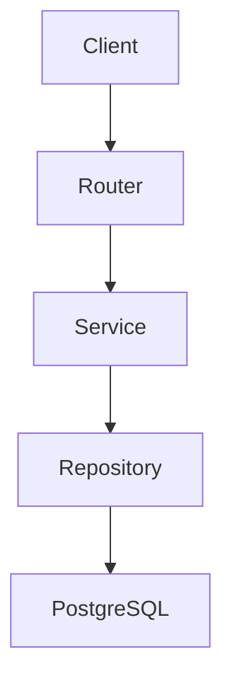
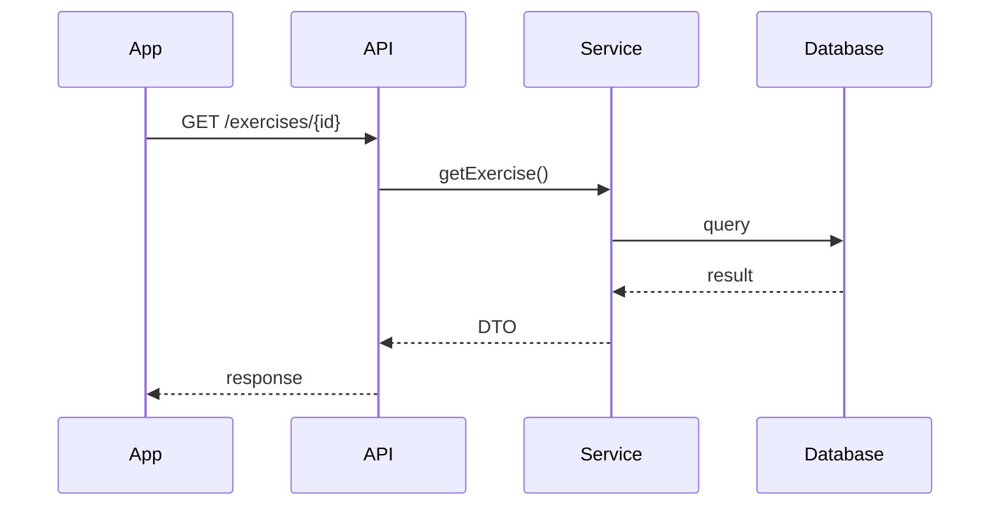
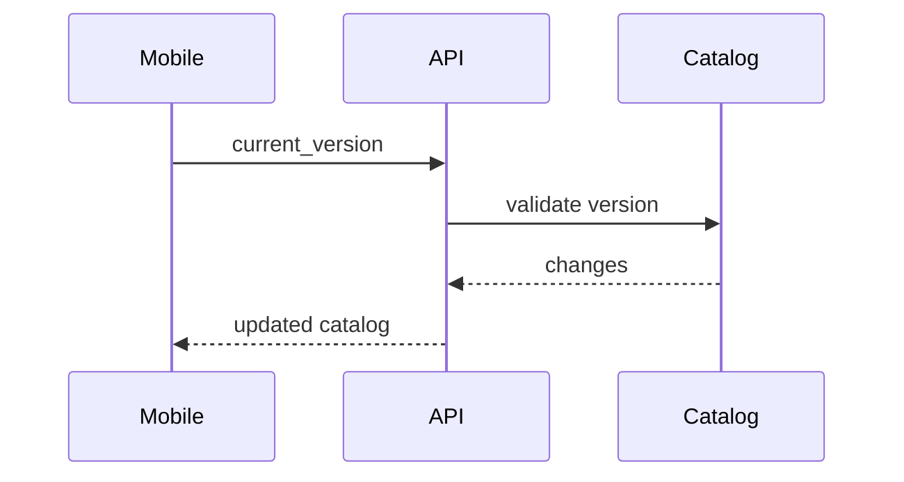
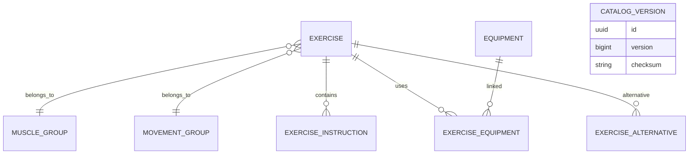

# Fluxo da Aplicação

```mermaid
flowchart TD

Client --> Router
Router --> Service
Service --> Repository
Repository --> PostgreSQL
```

---

# Fluxo de Consulta de Exercício

```mermaid
sequenceDiagram

participant App
participant API
participant Service
participant Database

App->>API: GET /exercises/{id}

API->>Service: getExercise()

Service->>Database: query

Database-->>Service: result

Service-->>API: DTO

API-->>App: response
```

---

# Fluxo de Sincronização

```mermaid
sequenceDiagram

participant Mobile
participant API
participant Catalog

Mobile->>API: current_version

API->>Catalog: validate version

Catalog-->>API: changes

API-->>Mobile: updated catalog
```

---

# Relacionamento de Entidades

```mermaid
erDiagram

EXERCISE }o--|| MUSCLE_GROUP : belongs_to

EXERCISE }o--|| MOVEMENT_GROUP : belongs_to

EXERCISE ||--o{ EXERCISE_INSTRUCTION : contains

EXERCISE ||--o{ EXERCISE_EQUIPMENT : uses

EQUIPMENT ||--o{ EXERCISE_EQUIPMENT : linked

EXERCISE ||--o{ EXERCISE_ALTERNATIVE : alternative

CATALOG_VERSION {
    uuid id
    bigint version
    string checksum
}
```
